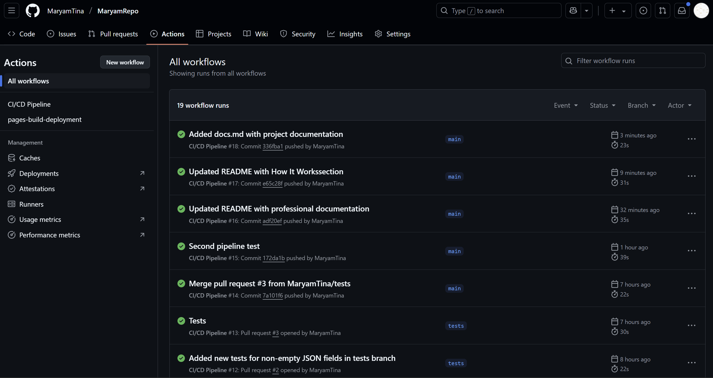

# Customer Data Display Project

A web application for displaying customer data from a JSON file, integrated with a robust CI/CD pipeline using GitHub Actions. This project fulfills academic requirements for automated data processing, testing, and deployment.

## Overview

This repository ([MaryamTina/MaryamRepo](https://github.com/MaryamTina/MaryamRepo)) hosts a web application that showcases customer data in a tabular format. It leverages Python for data generation and transformation, JavaScript for frontend rendering, and GitHub Actions for continuous integration and deployment to GitHub Pages.

## Features

- **Data Generation**: Creates synthetic customer data (`profiles1.csv`) using `generate.py` with the `Faker` library.
- **Data Transformation**: Converts CSV to JSON (`data.json`) via `csvtojson.py` for web consumption.
- **Web Interface**: Renders data in a responsive table using `index.html` and `script.js`.
- **CI/CD Pipeline**: Automates testing and deployment through `main.yml`, ensuring reliable updates to GitHub Pages.
- **Unit Testing**: Validates data integrity with `calculateTests.py` (business logic) and `test_data.py` (CSV/JSON validation).

## How It Works

- `generate.py`: Produces `profiles1.csv` with 1000+ fake customer records.
- `csvtojson.py`: Converts `profiles1.csv` to `data.json`.
- `script.js`: Loads `data.json` and populates the table in `index.html`.
- The CI/CD pipeline (`main.yml`) automates data generation, testing, and deployment to GitHub Pages.

## Setup Instructions

1. Clone the repository: `git clone https://github.com/MaryamTina/MaryamRepo`
2. Ensure Python 3.8+ is installed.
3. Install dependencies: `pip install -r requirements.txt`
4. Run tests: `pytest test_data.py`
5. Access the live site: [GitHub Pages](https://MaryamTina.github.io/MaryamRepo)

## Branching Strategy

- `pipeline`: Integrated `generate.py` and `csvtojson.py` into the CI/CD workflow.
- `tests`: Added comprehensive tests for CSV (12 columns, 900+ rows) and JSON validation.

## Screenshots

## Documentation

See [detailed documentation](docs/docs.md) for project details.

## License

This project is licensed under the MIT License - see the [LICENSE](LICENSE) file for details.

*Developed as part of an academic project at Nackademin.*

